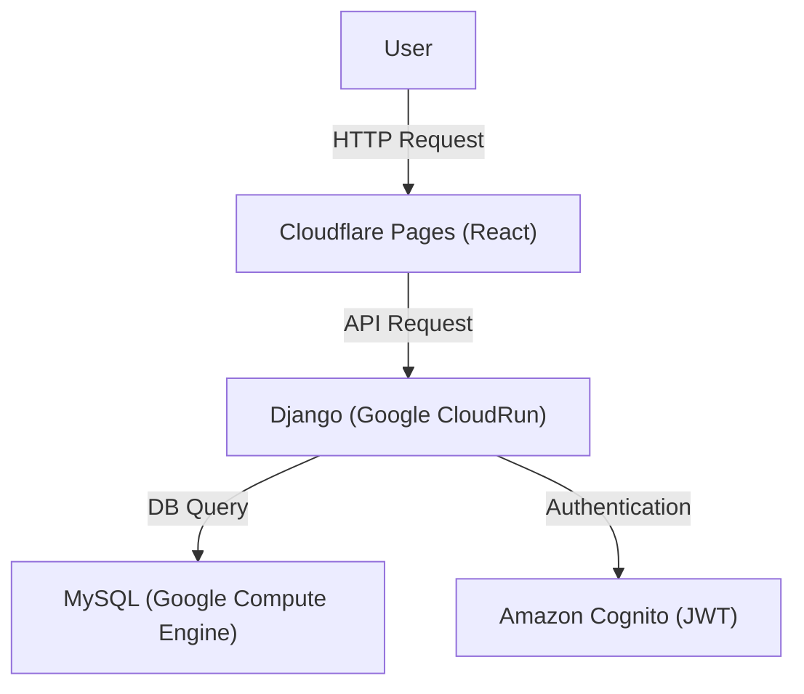

# AI面接コーチβ
アーキテクチャ図

```mermaid
graph TD;
    User -->|HTTP Request| Cloudflare_Pages["Cloudflare Pages (React)"];
    Cloudflare_Pages -->|API Request| CloudRun["Django (Google CloudRun)"];
    CloudRun -->|DB Query| MySQL["MySQL (Google Compute Engine)"];
    CloudRun -->|Authentication| Cognito["Amazon Cognito (JWT)"];

```
